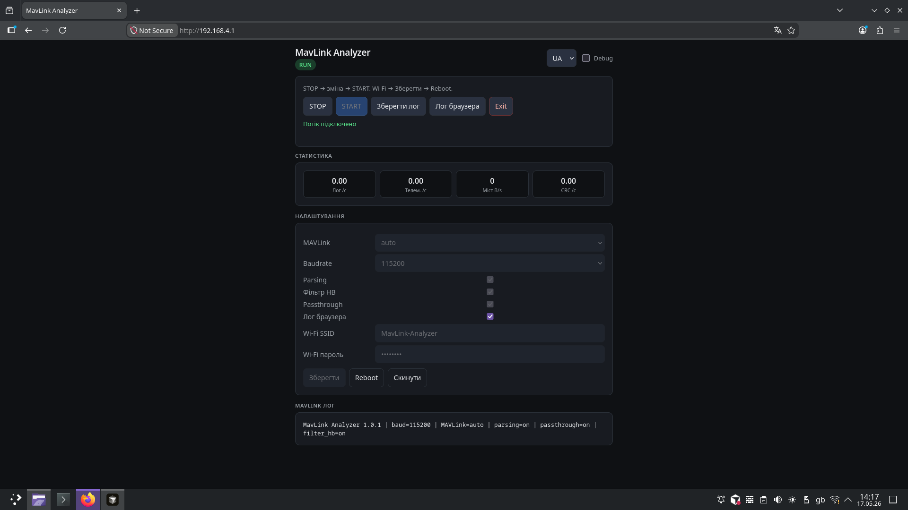
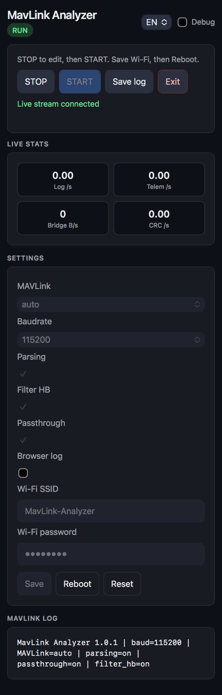

# MavLink Analyzer

**Version:** 1.0.1 (release) · **Hardware:** ESP32-C3 Super Mini  
**License:** Proprietary — [LICENSE](LICENSE) (not open source)

Прозорий MAVLink-міст між політним контролером і приймачем, з веб-журналом потоку **приймач → FC**.

---

## Публічний репозиторій (неповний код)

Тут — **документація** і **частина** вихідного коду для ознайомлення. Повна робоча прошивка в цьому репозиторії **не публікується**.

| Можна | Не можна (без письмового дозволу) |
|-------|-----------------------------------|
| Читати інструкції та техспецифікацію | Використовувати прошивку |
| Переглядати заголовки та зразкові `.cpp` | Зібрати робочу копію з цього репо |
| Бачити список парсованих MAVLink-повідомлень (`analyzer.xml`) | Копіювати заглушки в інший продукт |

Деталі: **[docs/PUBLIC_CODE_MANIFEST.md](docs/PUBLIC_CODE_MANIFEST.md)** · [REPOSITORY_POLICY.md](REPOSITORY_POLICY.md)

**Збірка повної прошивки з цього репозиторію неможлива** — ключові модулі опубліковані як заглушки.

---

## Документація

| Документ | Мова |
|----------|------|
| [USER_GUIDE_v1.0.1_ua.md](docs/USER_GUIDE_v1.0.1_ua.md) | Українська — інструкція користувача |
| [USER_GUIDE_v1.0.1_eng.md](docs/USER_GUIDE_v1.0.1_eng.md) | English — user guide |
| [TECHNICAL_SPECIFICATION_v1.0_ua.md](docs/TECHNICAL_SPECIFICATION_v1.0_ua.md) | Українська — технічна специфікація |
| [TECHNICAL_SPECIFICATION_v1.0_eng.md](docs/TECHNICAL_SPECIFICATION_v1.0_eng.md) | English — technical specification |

Підключення GPIO та UART — у техспецифікації, [§2](docs/TECHNICAL_SPECIFICATION_v1.0_ua.md#2-апаратна-частина).

---

## Скриншоти веб-інтерфейсу

| | |
|---|---|
|  |  |
| Desktop | Mobile |

Код UI (`web_page.h`) в репозиторій **не входить** — лише знімки для ознайомлення.

---

## Структура репозиторію

```
include/          Заголовки API (усі модулі)
src/              3 повних .cpp + заглушки ядра
lib/mavlink/      analyzer.xml (без згенерованого C)
docs/             Інструкції та специфікації
screenshots/      Знімки веб-інтерфейсу
platformio.ini    Довідник плати/залежностей
```

---

## Підключення (коротко)

| Зв’язок | GPIO ESP32-C3 |
|---------|----------------|
| FC TX → ESP RX | **20** (UART0) |
| ESP TX → FC RX | **21** |
| Receiver TX → ESP RX | **4** (UART1) |
| ESP TX → Receiver RX | **5** |

**3.3 V UART**, 115200 8N1 за замовчуванням. Деталі — [техспецифікація §2](docs/TECHNICAL_SPECIFICATION_v1.0_ua.md#2-апаратна-частина).

---

## Wi‑Fi та веб-інтерфейс

| Параметр | За замовчуванням |
|----------|------------------|
| SSID | `MavLink-Analyzer` |
| Пароль | `12345678` |
| URL | http://192.168.4.1 |

Код веб-інтерфейсу (`web_page.h`) **не опублікований**.

---

## Контакт і ліцензія

- [CONTACT.md](CONTACT.md) — запити на ліцензування  
- [LICENSE](LICENSE) — усі права захищені

---

*© 2026 darknode. All rights reserved.*
